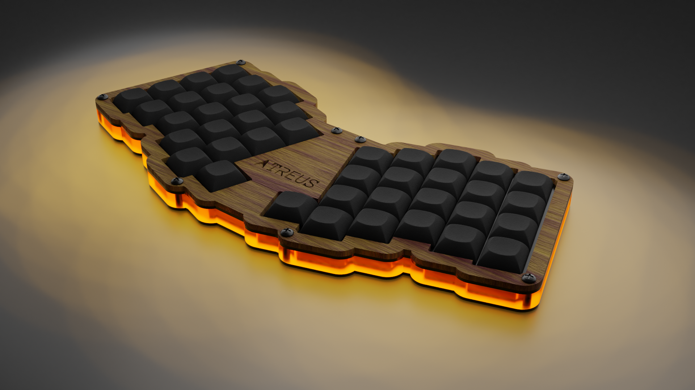

# [Atreus](https://github.com/technomancy/atreus) keyboard design files implemented in [diagrams](http://hackage.haskell.org/package/diagrams)

## :warning: This is highly experimental project
## :warning: The generated files were not (yet) used to build an actual keyboard !
## :warning: Do not trust the generated files !

This is another attempt at generating mechanical keyboard design files programmatically.
Previous one is [here](https://github.com/mryndzionek/h-atreus).
I had a felling that [diagrams](http://hackage.haskell.org/package/diagrams) offered everything
that is needed to achieve this goal and it turned out true.

Overall I think it's a progress. The generated SVG files are smaller and look better.
Scale is also adjusted (96 DPI), so apps like Inkscape show correct dimensions.
Inkscape can also be used to convert the files to other formats like DXF.
Generated Blender files tarballs can be found in releases.

Gallery [here](GALLERY.md)




Compiling and running
---------------------

```sh
stack build && stack exec kbdSVGGen
```

TODO
----
  - [?] refactor the code to use lenses more
  - [ ] places for connectors
  - [x] 'split' option
  - [ ] simple web UI interface
